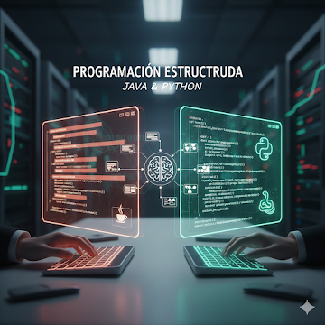

# Programación Estructurada (Java & Python)

# 💻 Programación Estructurada: Java & Python

## 📖 Descripción del Curso
Esta asignatura es la piedra angular en la formación de cualquier desarrollador. Se enfoca en el diseño e implementación de algoritmos bajo el **paradigma de programación estructurada**. A través del estudio comparativo entre **Python** (lenguaje interpretado y dinámico) y **Java** (lenguaje compilado y de tipado fuerte), el estudiante desarrollará un pensamiento lógico riguroso para resolver problemas computacionales.

---

## 📑 Contenido del Programa

### 1. Fundamentos y Tipado
* **Entorno de desarrollo:** Configuración de JDK para Java y el intérprete de Python.
* **Variables y constantes:** Declaración, inicialización y ámbito (scope).
* **Tipos de datos:** Diferencias entre el tipado estático de Java y el dinámico de Python.

### 2. Estructuras de Control
* **Selección:** Sentencias `if-else` y `switch` (Java) vs `match/case` (Python).
* **Repetición:** Uso de bucles `for`, `while` y `do-while`.
* **Control de flujo:** `break`, `continue` y manejo de excepciones básico.

### 3. Estructuras de Datos Lineales
* **Arreglos (Arrays):** Manejo de memoria estática en Java.
* **Listas y Diccionarios:** Flexibilidad y métodos integrados en Python.
* **Operaciones:** Búsqueda, inserción y recorrido de colecciones.

### 4. Modularidad y Funciones
* Definición de funciones en Python y métodos estáticos en Java.
* Paso de parámetros y retorno de valores.
* Recursividad básica.

---

## 🛠️ Herramientas y Tecnologías
| Característica | Python 🐍 | Java ☕ |
| :--- | :--- | :--- |
| **Enfoque** | Simplicidad y Legibilidad | Estructura y Robustez |
| **Compilación** | Interpretado | Compilado (Bytecode) |
| **Uso común** | Data Science, Scripts, IA | Backend, Apps Móviles, Enterprise |
| **IDE Sugerido** | PyCharm / VS Code | IntelliJ IDEA / Eclipse |

---

